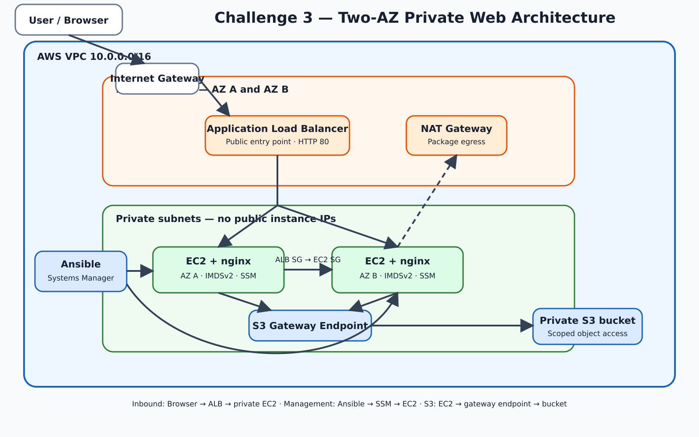

# Challenge 3: Two-AZ Private Web Architecture on AWS

Terraform provisions a two-AZ AWS web architecture. Ansible configures two private EC2 instances through AWS Systems Manager, with no SSH, public instance IPs, or stored AWS keys.

**Stack:** Terraform · Ansible · AWS VPC · EC2 · ALB · S3 · IAM · NAT Gateway · Systems Manager · nginx

## Submission at a glance

| Grading area | Implementation | Proof path | Status |
| --- | --- | --- | --- |
| Reproducible infrastructure | Terraform creates the network, load balancer, compute, IAM, S3, and endpoint resources | [`terraform/`](./terraform/) and the validation commands below | Implemented |
| Configuration management | Ansible discovers instances by tag and configures nginx over SSM | [`ansible/`](./ansible/) | Implemented |
| Public web access | Internet-facing ALB forwards HTTP to private instances | `alb_dns_name`, HTTP 200, and target-health checks | Implemented |
| Multi-AZ placement | Two public and two private subnets; one instance per private subnet | EC2 placement and repeated-request checks | Implemented |
| Least exposure | No public instance IPs, no SSH rule, EC2 SG accepts HTTP only from the ALB SG | Terraform code and AWS CLI checks | Implemented |
| Workload identity | EC2 instance profile reads one S3 object; SSM uses the instance role | [`terraform/iam.tf`](./terraform/iam.tf) | Implemented |
| Network audit baseline | VPC Flow Logs resources are defined in Terraform | [`terraform/security-baseline.tf`](./terraform/security-baseline.tf) | **Coded, not applied or evidenced** |
| Default-SG lockdown | Deny-all default security group is defined in Terraform | [`terraform/security-baseline.tf`](./terraform/security-baseline.tf) | **Coded, not applied or evidenced** |
| ALB and S3 access logs | Accepted Checkov remediation item | Security findings register below | **Planned, not coded** |

The status column is authoritative. A Terraform resource appearing in the repository does not count as deployed proof unless the corresponding verification output was captured from the final environment.

## Architecture



Diagram source: [`docs/architecture/challenge-3-architecture.mmd`](./docs/architecture/challenge-3-architecture.mmd)

### Traffic and management paths

- **Inbound request:** user → internet gateway → public ALB → EC2 on port 80.
- **Package egress:** private EC2 → NAT Gateway → internet.
- **S3 retrieval:** private EC2 → S3 Gateway VPC endpoint → private S3 bucket.
- **Administration:** Ansible control node → Systems Manager → EC2. There is no SSH listener, key pair, or bastion.

### Deliberate architecture tradeoffs

| Choice | Reason | Production change |
| --- | --- | --- |
| Two EC2 instances | Removes the single-instance and single-AZ failure point | Use an Auto Scaling group and immutable image or launch template |
| One NAT Gateway | Keeps lab cost lower | One NAT Gateway per AZ with AZ-local private routes |
| HTTP listener | No domain or ACM certificate is available for the lab | Terminate TLS 1.2+ at the ALB and redirect HTTP to HTTPS |
| SSE-S3 | Adequate encryption for the lab without KMS key cost and policy overhead | Use a customer-managed KMS key where key control is required |
| ALB deletion protection off | Supports repeated teardown | Enable for persistent environments |

## Evidence pack

Run the checks against the final deployment and save the terminal output or screenshots with the submission. Replace angle-bracket placeholders before running commands.

### 1. Terraform quality and deployment

```bash
cd terraform
terraform fmt -check -recursive
terraform validate
aws-vault exec terraform -- terraform plan
aws-vault exec terraform -- terraform apply
terraform output
```

**What this proves:** formatted and valid infrastructure code, a successful AWS deployment, and the final VPC, subnet, bucket, and ALB outputs.

### 2. Dynamic inventory and SSM connectivity

```bash
cd ../ansible
export ANSIBLE_CONFIG="$(pwd)/ansible.cfg"
eval "$(aws configure export-credentials --profile terraform --format env)"
ansible-inventory --graph
ansible all -m ping
ansible-playbook playbook.yml
```

**Pass condition:** both instances appear in inventory, both return `pong` over SSM, and the play recap has `failed=0`.

### 3. Application availability and two-AZ distribution

```bash
ALB_DNS="$(cd ../terraform && terraform output -raw alb_dns_name)"
curl -I "http://${ALB_DNS}"

for i in $(seq 1 12); do
  curl -s -H 'Connection: close' "http://${ALB_DNS}" \
    | grep -E 'Server|Availability Zone|Instance ID'
done
```

**Pass condition:** the ALB returns HTTP 200 and responses show both server identities or both Availability Zones.

### 4. ALB target health

```bash
TG_ARN="$(aws elbv2 describe-target-groups \
  --names challenge3-tg \
  --query 'TargetGroups[0].TargetGroupArn' \
  --output text)"

aws elbv2 describe-target-health \
  --target-group-arn "$TG_ARN" \
  --query 'TargetHealthDescriptions[].{Instance:Target.Id,State:TargetHealth.State}' \
  --output table
```

**Pass condition:** two registered targets report `healthy`.

### 5. Private-instance proof

```bash
aws ec2 describe-instances \
  --filters 'Name=tag:Project,Values=challenge3' 'Name=instance-state-name,Values=running' \
  --query 'Reservations[].Instances[].{Instance:InstanceId,AZ:Placement.AvailabilityZone,PrivateIP:PrivateIpAddress,PublicIP:PublicIpAddress,Profile:IamInstanceProfile.Arn}' \
  --output table
```

**Pass condition:** two instances are in different AZs, each has a private IP and instance profile, and `PublicIP` is empty.

### 6. Security-group and no-SSH proof

```bash
VPC_ID="$(cd ../terraform && terraform output -raw vpc_id)"

aws ec2 describe-security-groups \
  --filters "Name=vpc-id,Values=${VPC_ID}" \
  --query 'SecurityGroups[].{Name:GroupName,Ingress:IpPermissions}' \
  --output json

aws ec2 describe-security-groups \
  --filters "Name=vpc-id,Values=${VPC_ID}" \
  --query 'SecurityGroups[].IpPermissions[?FromPort==`22`]' \
  --output json
```

**Pass condition:** the EC2 group references the ALB group on port 80 and the port-22 query returns no rules.

### 7. IAM and S3 control proof

```bash
aws s3api get-public-access-block --bucket <bucket-name>
aws s3api get-bucket-encryption --bucket <bucket-name>
aws s3api get-bucket-versioning --bucket <bucket-name>

aws ec2 describe-iam-instance-profile-associations \
  --filters 'Name=state,Values=associated' \
  --output table
```

**Pass condition:** all four public-access settings are `true`, encryption is AES256, versioning is enabled, and the instance-profile association is active.

### 8. Static security scanning

```bash
python3 -m checkov -d terraform/ --compact
python3 -m checkov -d ansible/ --framework ansible --compact
```

The recorded scan baseline is **76 passed and 24 failed for Terraform; no Ansible failures**. A changed result is not automatically bad, but it must be reconciled with the findings register before submission.

## Security baseline: verified versus staged

### Verified in the deployed implementation

- EC2 instances have no public IP addresses.
- Port 22 is not opened and no EC2 key pair is configured.
- Systems Manager provides administrative and Ansible connectivity.
- IMDSv2 is required.
- Root EBS volumes are encrypted.
- The instance security group accepts port 80 only from the ALB security group.
- S3 Block Public Access, BucketOwnerEnforced ownership, versioning, and SSE-S3 are declared.
- The EC2 role grants `s3:GetObject` for one object rather than broad bucket access.
- An S3 Gateway VPC endpoint keeps S3 traffic off the NAT path.

### Coded but not applied or verified

The following resources are present in [`terraform/security-baseline.tf`](./terraform/security-baseline.tf), but they were staged after the last evidenced deployment:

| Control | Terraform resources | What remains before it can be claimed |
| --- | --- | --- |
| VPC Flow Logs | CloudWatch log group, service role and policy, `aws_flow_log` | Apply, confirm `ACTIVE`, and query recent CloudWatch log events |
| Default security-group lockdown | `aws_default_security_group` with no ingress or egress | Apply and verify both permission lists are empty |

These controls must not be described as deployed in the submission unless the final apply and runtime checks are captured.

Suggested post-apply checks:

```bash
aws ec2 describe-flow-logs \
  --filter "Name=resource-id,Values=${VPC_ID}" \
  --query 'FlowLogs[].{Status:FlowLogStatus,Traffic:TrafficType,Destination:LogDestination}' \
  --output table

aws ec2 describe-security-groups \
  --filters "Name=vpc-id,Values=${VPC_ID}" 'Name=group-name,Values=default' \
  --query 'SecurityGroups[].{Ingress:IpPermissions,Egress:IpPermissionsEgress}' \
  --output json
```

## Checkov findings register

| Finding | Status | Decision record |
| --- | --- | --- |
| `CKV2_AWS_11` VPC Flow Logs | Coded, not applied | High-value network audit control; evidence still required |
| `CKV2_AWS_12` default SG unrestricted | Coded, not applied | Deny-all resource exists; evidence still required |
| `CKV_AWS_91`, `CKV_AWS_18` access logging | Planned | Requires a dedicated logging bucket and ALB/S3 configuration |
| HTTPS/TLS findings | Accepted for lab | No domain or ACM certificate; production terminates TLS at the ALB |
| `CKV_AWS_145` S3 KMS encryption | Accepted for lab | SSE-S3 selected as a documented cost and key-management tradeoff |
| `CKV_AWS_150` ALB deletion protection | Accepted for lab | Disabled to support routine teardown |
| `CKV_AWS_260` public port 80 | Intended design | Applies to the public ALB; compute remains private |
| `CKV_AWS_130` public subnet IP assignment | Intended design | Applies only to public subnets; private subnets do not assign public IPs |
| `CKV_AWS_382` unrestricted egress | Accepted for lab | Required for package retrieval through NAT; production should restrict destinations |
| Replication, lifecycle, monitoring, EBS optimization, WAF findings | Deferred | Enterprise controls outside the lab requirement; reconsider for production |

## Code map

| File | Responsibility |
| --- | --- |
| [`terraform/vpc.tf`](./terraform/vpc.tf) | VPC, two public and two private subnets, internet gateway, NAT Gateway, routes |
| [`terraform/security-group.tf`](./terraform/security-group.tf) | Public ALB ingress and ALB-to-instance security-group chain |
| [`terraform/alb.tf`](./terraform/alb.tf) | ALB, target group, listener, health checks |
| [`terraform/ec2.tf`](./terraform/ec2.tf) | Two private instances, encrypted roots, IMDSv2, target registration |
| [`terraform/iam.tf`](./terraform/iam.tf) | EC2 trust, least-privilege S3 access, SSM policy, instance profile |
| [`terraform/s3.tf`](./terraform/s3.tf) | Private, encrypted, versioned content bucket and object |
| [`terraform/endpoints.tf`](./terraform/endpoints.tf) | S3 Gateway VPC endpoint |
| [`terraform/security-baseline.tf`](./terraform/security-baseline.tf) | Staged Flow Logs and default-SG controls |
| [`ansible/aws_ec2.yml`](./ansible/aws_ec2.yml) | Tag-based dynamic inventory and SSM connection |
| [`ansible/playbook.yml`](./ansible/playbook.yml) | Idempotent nginx installation, template rendering, and service state |

## Deployment

```bash
cd terraform
aws-vault exec terraform -- terraform init
aws-vault exec terraform -- terraform plan
aws-vault exec terraform -- terraform apply
```

Then run the Ansible commands in evidence step 2. The public URL is:

```bash
cd terraform
terraform output -raw alb_dns_name
```

## Teardown

```bash
cd terraform
aws-vault exec terraform -- terraform destroy
```

The NAT Gateway and ALB incur hourly charges. Confirm that `destroy` completes before ending a lab session.

## Interview explanation

> I used Terraform to build a two-AZ VPC with a public Application Load Balancer and private EC2 web servers. Ansible discovers the instances dynamically and reaches them through Systems Manager, so the design needs no SSH ingress, bastion, public instance IPs, or static credentials. The instance role is a non-human identity scoped to one S3 object. I used Checkov as a policy signal, then separated verified controls, staged remediation, and accepted lab exceptions so the documentation never claims more than the evidence proves.
