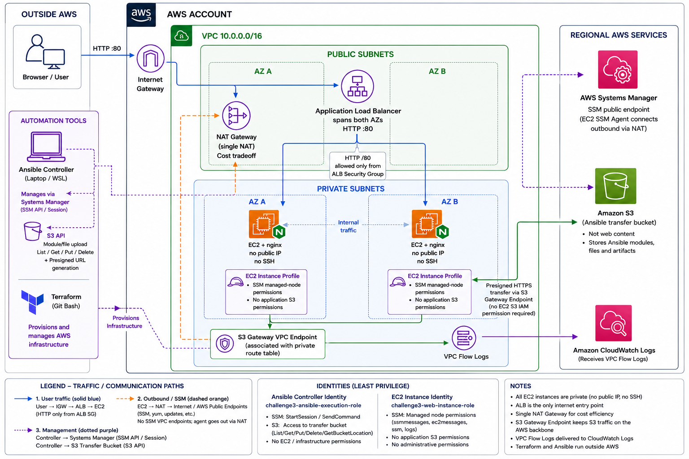

# Project Documentation

This directory contains the deeper technical documentation for the project.

The root [`README.md`](../README.md) provides the project overview.

## Architecture diagram



The diagram lives at [`evidence/infrastructure/architecture-diagram.png`](evidence/infrastructure/architecture-diagram.png). Traffic paths and ownership are explained in [`architecture.md`](architecture.md).

## Documentation

| Document | Purpose |
|---|---|
| [`architecture.md`](architecture.md) | Deployed AWS architecture, traffic paths, ownership boundaries, and tradeoffs |
| [`security-model.md`](security-model.md) | IAM identities, trust boundaries, least privilege, security validation, and Checkov decisions |
| [`installation.md`](installation.md) | Reproducible Terraform, AWS Vault, WSL, SSM, and Ansible deployment procedure |
| [`cleanup.md`](cleanup.md) | AWS teardown, identity offboarding, cost cleanup, and teardown validation |
| [`evidence/`](evidence/) | Screenshots supporting selected implementation and security claims, including the architecture diagram |

## Source-of-Truth Boundaries

```text
Terraform
    -> AWS infrastructure

Ansible
    -> host and nginx configuration

IAM / STS
    -> AWS authentication and authorization

Application Load Balancer
    -> public application boundary

Private EC2
    -> application compute

S3
    -> temporary Ansible/SSM transfer storage
```