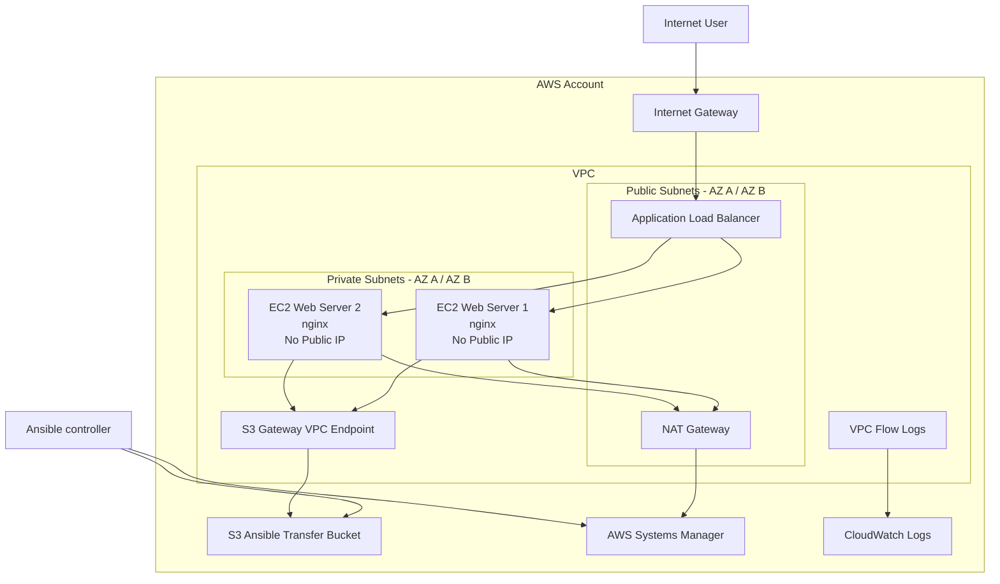

# Architecture

## Overview

This project deploys a two-AZ AWS web architecture using Terraform for infrastructure provisioning and Ansible for host configuration.

The public application boundary is an Application Load Balancer. The nginx web servers run on EC2 instances in private subnets with no public IPv4 addresses.

Configuration management uses AWS Systems Manager rather than SSH.

Identity, IAM, and scanner exceptions are documented in [security-model.md](security-model.md).

---

## Architecture Diagram



There are no SSM interface VPC endpoints. Session Manager and other AWS APIs from the instances leave the private subnets through the NAT Gateway.

---

## Application Traffic Path

Public application traffic follows this path:

```text
Internet user
     |
     v
Internet Gateway
     |
     v
Application Load Balancer
     |
     | TCP/80
     v
EC2 security group
     |
     v
nginx
```

The Application Load Balancer is the public application entry point.

The EC2 instances:

- run in private subnets
- have no public IPv4 addresses
- accept HTTP only from the ALB security group
- expose no SSH port

Repeated HTTP requests proved that the ALB forwards requests to both EC2 instances across separate Availability Zones.

---

## Availability Zone Layout

The VPC contains:

- two public subnets
- two private subnets
- one EC2 web server per private subnet
- an Application Load Balancer spanning both public subnets

The application-serving tier spans two Availability Zones.

The project uses one NAT Gateway in the first public subnet. This is a deliberate lab cost tradeoff.

The application path has multi-AZ compute, but outbound package-management and external-management traffic retain a single NAT dependency.

---

## Public and Private Subnets

A subnet is public when its route table sends internet-bound traffic to an Internet Gateway.

Public subnet routing:

```text
0.0.0.0/0
    |
    v
Internet Gateway
```

Private subnet routing:

```text
0.0.0.0/0
    |
    v
NAT Gateway
```

Automatic public-IP assignment is disabled on all subnets.

The public subnets remain public through routing rather than automatic EC2 public-IP allocation.

---

## Terraform Ownership

Terraform owns the AWS infrastructure lifecycle.

Terraform provisions:

- VPC
- Internet Gateway
- public and private subnets
- route tables
- NAT Gateway
- Elastic IP
- S3 Gateway VPC endpoint
- Application Load Balancer
- target group
- HTTP listener
- EC2 instances
- security groups
- IAM roles
- EC2 instance profile
- S3 transfer bucket
- VPC Flow Logs
- CloudWatch log group
- default security-group lockdown

Terraform state links the configuration to deployed AWS resources.

---

## Ansible Ownership

Ansible owns operating-system and application configuration.

Ansible:

- discovers EC2 instances through AWS dynamic inventory
- selects the Challenge 3 instances from AWS tags
- connects through AWS Systems Manager
- gathers EC2 metadata
- installs nginx
- renders the Jinja web-page template
- starts and enables nginx

Terraform does not install nginx.

Ansible does not provision the VPC, ALB, IAM roles, or EC2 infrastructure.

---

## Terraform and Ansible Integration

The tools are loosely coupled through AWS metadata.

```text
Terraform
    |
    | creates EC2
    | applies Project and Server tags
    v
AWS EC2
    ^
    | dynamic inventory query
    |
Ansible
```

Instance IDs and private IP addresses are not hardcoded into Ansible inventory.

The inventory can rediscover replacement EC2 instances when the Terraform-managed hosts change.

---

## Systems Manager Configuration Path

Administration does not use SSH.

```text
Ansible controller
       |
       | temporary AWS credentials
       v
Challenge3 Ansible Execution Role
       |
       v
AWS Systems Manager
       ^
       |
SSM Agent on EC2
       |
       | outbound via NAT
       v
NAT Gateway
```

No inbound port 22 rule exists.

No SSH key pair is required for configuration management.

---

## S3 Transfer Path

S3 is not the web-page source.

The S3 bucket exists for Ansible's `amazon.aws.aws_ssm` connection path.

```text
Ansible controller
       |
       | temporary module/file transfer
       v
S3 transfer bucket
       ^
       |
       | S3 Gateway VPC endpoint
       |
SSM-managed EC2 instance
```

The bucket is private and configured with:

- S3 Block Public Access
- Bucket Owner Enforced ownership
- SSE-S3 encryption
- versioning suspended
- one-day object expiration
- one-day incomplete multipart-upload cleanup
- Terraform `force_destroy`

Versioning remains suspended so deleted temporary Ansible payloads do not persist as historical versions.

---

## Network Logging

VPC Flow Logs capture VPC traffic and publish records to CloudWatch Logs.

The Flow Logs IAM role trusts the VPC Flow Logs service.

The trust relationship limits service assumption using:

- `aws:SourceAccount`
- `aws:SourceArn`

This reduces confused-deputy exposure in the service-role trust path.

---

## Security Group Flow

### ALB security group

Inbound:

```text
Internet
   |
TCP/80
   |
   v
ALB
```

Outbound is limited to HTTP traffic required for the application targets.

### EC2 security group

Inbound:

```text
ALB security group
       |
     TCP/80
       |
       v
EC2
```

The EC2 security group does not expose HTTP directly to the internet.

Outbound access is limited to HTTP and HTTPS required for package retrieval and AWS service communication.

---

## Application Verification

The deployed page exposes live EC2 metadata:

- server number
- Availability Zone
- instance ID

Repeated requests showed responses from both instances in both Availability Zones.

Evidence:

- [docs/evidence/application/live-web-application.png](evidence/application/live-web-application.png)
- [docs/evidence/infrastructure/alb-multiaz-distribution.png](evidence/infrastructure/alb-multiaz-distribution.png)

---

## Configuration Idempotence

The Ansible playbook was executed after both hosts had reached the desired state.

Final recap for both EC2 instances:

- `changed=0`
- `unreachable=0`
- `failed=0`

Evidence: [docs/evidence/ansible/idempotence-final.png](evidence/ansible/idempotence-final.png)

---

## Known Architecture Tradeoffs

### HTTP rather than HTTPS

The lab uses the AWS-generated ALB DNS name and does not use a registered domain or ACM certificate.

A production deployment would terminate TLS at the ALB.

### Single NAT Gateway

The application tier spans two Availability Zones, but private-subnet outbound traffic uses one NAT Gateway.

A production design requiring independent AZ egress would use a NAT Gateway per Availability Zone.

### No WAF

The application is a temporary static page.

A production internet-facing application may place AWS WAF in front of the ALB based on threat model and application requirements.

---

## Ownership Boundary

The architecture intentionally separates:

```text
Infrastructure state
        |
        v
Terraform

Host/application state
        |
        v
Ansible

Application traffic
        |
        v
ALB -> private EC2

AWS management access
        |
        v
IAM + STS + Systems Manager
```

This separation keeps infrastructure provisioning, configuration management, application traffic, and identity authority distinct.
